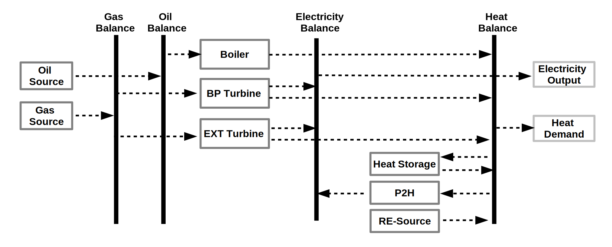

HESYSOPT stands for "Heating System Optimization Tool" and is a free, open source
tool to simulate district heating systems. It is developed in Python and
based on the open energy modelling framework (https://github.com/oemof/oemof),
specifically the solph-package. The mathematical approach is mixed-integer-linear
programming. 

Documentation
=============

To come....

Installing HESYSOPT
=====================

At the moment you need to clone the repository:

.. code:: bash

  git clone git@github.com:znes/HESYSOPT.git

HESYSOPT depends on oemof. Once you installed oemof, you should be ready to 
start as all dependencies that are required for HESYSOPT are coming along with
oemof (pandas, pyomo, etc.).

Running HESYSOPT
=====================

Once you downloaded the repository, change to the directory with the source code. 
You can now run the application with terminal command. 

To get information about app options, run the following command in your
terminal:

.. code:: bash

	python3 app.py --help

Provide the data in a csv-file. To see what structure is needed, checkout the
example directory inside the repository. 

Citing HESYSOPT
====================
There exist a short-paper for the EnvironInfo conference 2016 (submitted). 

Please cite as: 

S. Hilpert (2016) HESYSOPT - An optimization tool to support district heating flexibilisation. 
Short paper presented at the Environmental Informatics – Current trends and future perspectives based on 30 years of history, Berlin, 14-16 September 2016

